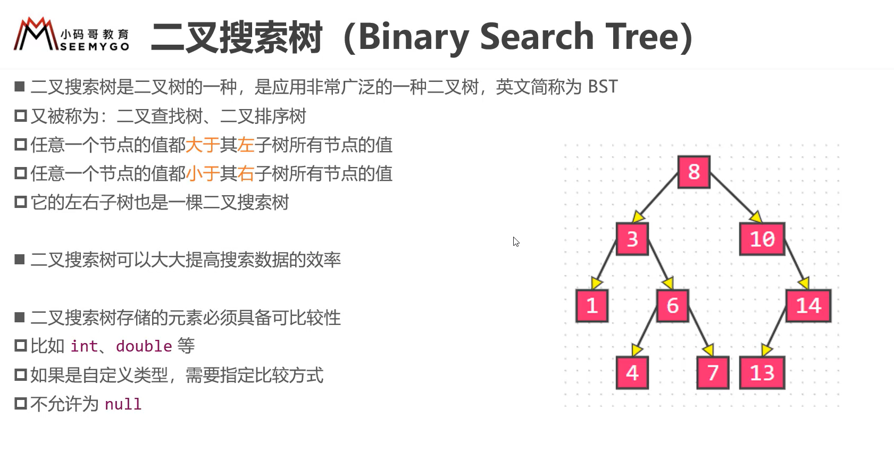
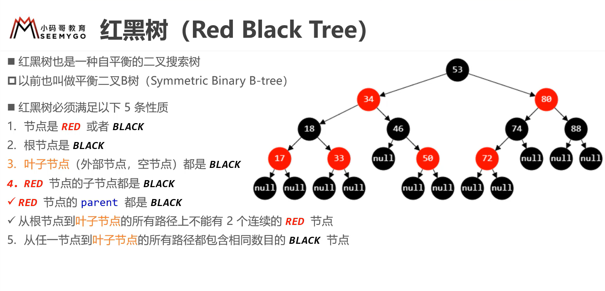

### 树结构
#### 种类
+ 二叉树
    + 每个节点最多有两个节点
+ avl树（平衡树）
    + 所有节点左右子树差小于1
+ 二叉搜索树
    + 左子树所有节点值小于它的根节点
    + 右子树所以节点值大于它的根节点
+ B树（也叫B-树 —— 平衡的多路搜索树，用于文件系统和数据库系统）
    + 一个节点可以有超过两个子节点
    + 每个节点的所有子树高度一致
    + 根节点及内部节点有两个子节点
    + 所有叶子在同一层
    + 有k个关键字的非叶子节点恰好有k+1个孩子
+ B+树
    + 非叶子节点不存放数据，只存放keys
    + B+树的叶子节点之间存在指针相连而且是单链表
#### 基本概念
+ 节点的度--子节点的数量
+ 节点的权--节点上赋予的数值
#### 二叉树
+ 定义：任何一个节点的数量都不超过2
+ 特点(数字代表含有子节点数量)
    + 节点数量
        + n0 = n2 + 1
        + n(二叉树总节点) = n0 + n1 + n2
    + 第i层节点最多有2^(i-1)个节点
    + 高度为i的二叉树最多有2^i - 1个节点
+ 延伸
    + 真二叉树
        + 所有节点的度（子节点数量）不是0就是2
    + 满二叉树
        + 所有节点的度（子节点数量）不是0就是2，并且所有叶子节点都在最后一层，并且节点数为2^n-1
    + 完全二叉树
        + 所有叶子节点都在最后一层或者倒数第二层，并且最后一层的叶子节点必须是从左开始延续，不能间断，倒数第二层的叶子在右边延续
+ 基本使用
    + 创建二叉树
        + Tree
            + 创建根节点就好了
        + TreeNode
            + data
            + 左孩子节点
            + 右孩子节点
            + 两个节点的set方法
        + 使用
            + 主函数创建tree对象
                + 创建treenode对象
                + tree.setroot设置根节点
                + 创建新节点，使用节点的设置方法添加为根节点的左孩子和右孩子
    + 遍历二叉树
        + 前序遍历
            + 中左右
        + 中序遍历（会是升序）
            + 左中右
        + 后序遍历
            + 左右中
        + 实现
            + 在节点中定义输出value的方法就好，如果存在左右节点使用递归循环输出，不同遍历只要更换顺序就好
    + 暴力删除节点
+ 链式存储二叉树
+ 顺序存储二叉树
    + 只考虑完全二叉树
        + 完全二叉树特性
            + 第n个元素的左子节点： 2*n + 1
            + 第n个元素的右子节点： 2*n + 2
            + 第n个元素的父子节点： (n-1)/2 
        + 在数组中存储二叉树上面的公式就显得尤其重要
+ 线索二叉树
    + 对于没有左孩子或者右孩子的节点，将他们的空余指针指向前后的节点，左指针指向前一个节点，右指针指向后一个节点
    + 如何判断前后呢？根据遍历类型得出的结果判断，比如使用先序遍历结果为123，那么1在2前，3在2后
#### 二叉搜索树

#### 二叉搜索树改进 —— 平衡二叉搜索树

+ 二叉平衡搜索树（Balanced Binary Search Tree —— bbst）

+ 一般情况下，二叉搜索树的搜索添加删除时间复杂度是o(h) = o(logn)级别（h代表树的高度）,但是当节点添加是有序的，二叉树就会退化为链表，时间复杂度变为o(n)，为了防止这种情况，提出了二叉平衡树的概念
+ 常见的二叉平衡搜索树 
  + AVL树
  + 红黑树
  + 上述两个二叉搜索树也称为自平衡的二叉搜索树

#### AVL树

+ 平衡因子
  + 某节点的左右子树高度差
+ avl树特点
  + 每个节点的平衡因子只可能是1,0，-1（即绝对值小于等于1，如果超过1则失衡）
+ 插入节点后后如果影响了平衡
  + 如果第一个不平衡的节点是因为左子树
    + 如果插入节点是在左子树的左子树上则左旋转
    + 如果插入节点是在左子树的右子树上则先进行左旋转再进行右旋转
  + 右子树同理

#### 红黑树

+ 性质

  + 节点是红色或者是黑色

  + 根节点必须是黑色

  + 叶子节点必须是黑色（这里的叶子节点指的是空节点）

  + 红色节点的子节点必然是黑色（也就是说红色节点的父节点必须是黑色，否则就违反这一条了）

  + 从任意节点到叶子节点的所有路径都包含相同数目的黑色节点

    

#### B树（也叫B-树 —— 平衡的多路搜索树，用于文件系统和数据库系统）

+ 观察发现
  + 一个节点可以有超过两个子节点
  + 每个节点的所有子树高度一致
+ m阶b树的性质（m阶代表一个节点最多可以拥有多少子节点）
  + 假设一个节点存储元素的个数为x
    + 元素数
      + 根节点包含元素： 1 < x < m - 1
      + 非根节点包含元素：ceiling(m/2) - 1 < x < m - 1 (ceiling向上取整)
      + 即所有节点中元素数量最多是 m-1
    + 节点数
      + 一个节点的子节点数量必定是 x+1
        + 根节点的子节点数： 2 < y < m
        + 非根节点子节点数:    ceiling(m/2) < y < m
        + 如果m = 3 那么子节点数  非根节点节点数 2-3，因此该树可以称为(2,3)树，2-3树
        + 如果m = 4 那么子节点数  非根节点节点数 2-4，因此该树可以称为(2,4)树，2-3-4树

#### 完全二叉树

+ 特点
    + 所有叶子节点都在最后一层或者倒数第二层，并且最后一层的叶子节点必须是从左开始延续，不能间断，倒数第二层的叶子在右边延续
    + 度为1的节点只有左子树
    + 度为1的节点只能有0个或者1个
    + 同样数量的二叉树，完全二叉树的高度最小
    + 假设完全二叉树的高度为h，它至少有2^(h-1)个节点(2^0+2^1+...+2^(h-2)+1)
    + 对一颗n个节点的完全二叉树进行（从上到下从左到右）编号
        + 对于编号为i的节点它的父节点时i/2
        + 节点i的左节点时，如果2*i < n则该节点有左子节点，且左子节点序号我2*i
